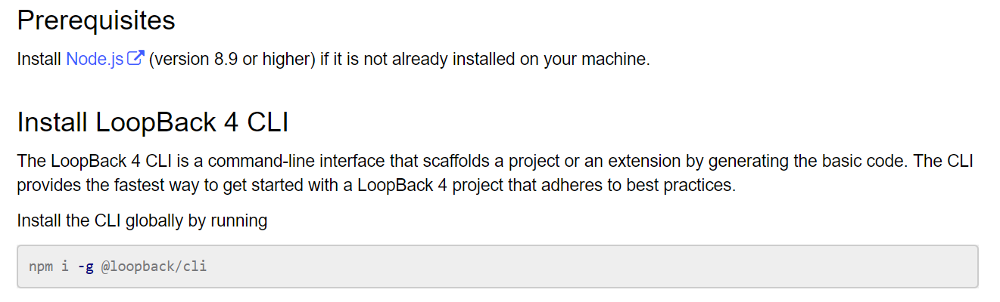
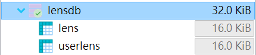
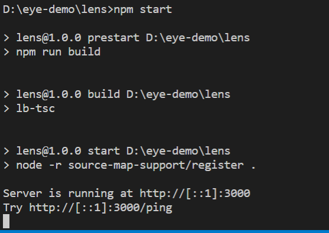

# loopback_lens
 

## 安裝

### 安裝loopback4

 

###	安裝 mariaDB
https://mariadb.org/download/
loopback專案中目前設置的db 資訊是:
username : root
password: 1234567
at  localhost : 3306
建議先設定成一樣的，然後載入lens.SQL，共一個db兩張表

 

###	靜態網頁資料放入  /public
將前端的資料放入/public並將主檔案命名為index.html

### 執行
進入根目錄下，執行npm install & npm start，應該會看到下圖代表成功

 

 
 

## API
可在執行npm start，成功開啟loopback後端後進入 http://localhost:3000/explorer，有API的示範，點擊API→try it out 可有範例的requestBody，只不過此頁面中的execute無法攜帶jwt驗證，因此測試API需要經過cmd的curl，或者註解掉後端的認證部分 (希望註解的話來問我吧)

### Userlens Model(使用者的隱眼紀錄) :

* 新增：[post] /user
  物件 id 會在新增物件的時候被後端自動指定(auto increase)，無法在request body指定
<pre>
requestBody = {
  "userId": 0,
  "lensId": 0,
  "lensCount": 0,         // 使用者選擇該隱眼的次數
  "lensTime": 0,          //更新使用者使用該隱眼的時長
  "createAt": "string",   // optional
  "updateAt": "string"    // optional
}
</pre>

* 取得：[get] /user/{user_id}  取得使用者的所有隱眼紀錄
  or [get] /user  取得所有user的所有資料
* 更新：[patch] /{user_id}/{lens_id}/time
  更新使用者使用該隱眼的時長
requestBody = { "lenstime": 0 }
* 更新：[patch] /{user_id}/{lens_id}/count
更新使用者選擇該隱眼的次數，count 直接 + 1

### Lens(隱形眼鏡模型) :
* 新增：[post] /lens
  id 會在新增物件的時候被後端自動指定(auto increase)
<pre>
requestBody = {
  "name": "string",
  "no": 0,
  "diameter": 0,
  "bc": 0,     //弧度
  "power": 0,   //度數
  "water": 0,    //含水量
  "wearingTime": "string",  // should be one of {"daily", "weekly", "monthly", "annually"}
  "placeOfProd": "string",   // 產地
  "price": 0,
  "specialPrice": 0,      // optional
  "eventDisp": "string",   // 活動敘述 optional
  "license": "string",   // 許可證字號
  "newTag": 0,      // 0 或 1
  "hotsaleTag": 0,  // 0 或 1
  "onsaleTag": 0,   // 0 或 1
  "createAt": "string",    // 上架時間  需為 "190303" 格式的日期字串
  "updateAt": "string",      // 下架時間 optional, 格式同上
  "url": "string"        // optional
}
</pre>

* 刪除：[delete] /lens/{id}
* 排序：[patch]  /lens/sort/{id1}/{id2}
  還沒做，這個的功能是?
* 命名：[patch]  /lens/{id}/name
<pre>
  requestBody = {  "name": "string" }
</pre>
* 更新：[patch]  /lens/{id}
<pre>
requestBody = {  看你想更新甚麼屬性就放進來吧  }
</pre>

### Admin(管理者模型) :
* 新增：[post] /admin/register
<pre>
requestBody = {
  "account": "string",    // unique & id field
  "password": "string",   // len(password) >= 8
  "creatat": "string",
  "name": "string"
}
</pre>
* 登入：[post] /admin/login
會回傳jwt token，在其他的API中，需在header中加入{"Authorization: "Bearer {token}" } 可成功認證
token 會在expire time 之後失效
<pre>
requestBody = {
  "account": "string",
  "password": "string"
}
</pre>
* 登出：[post] /admin/logout
目前還沒有特別的動作或黑名單，這是個空的函式
